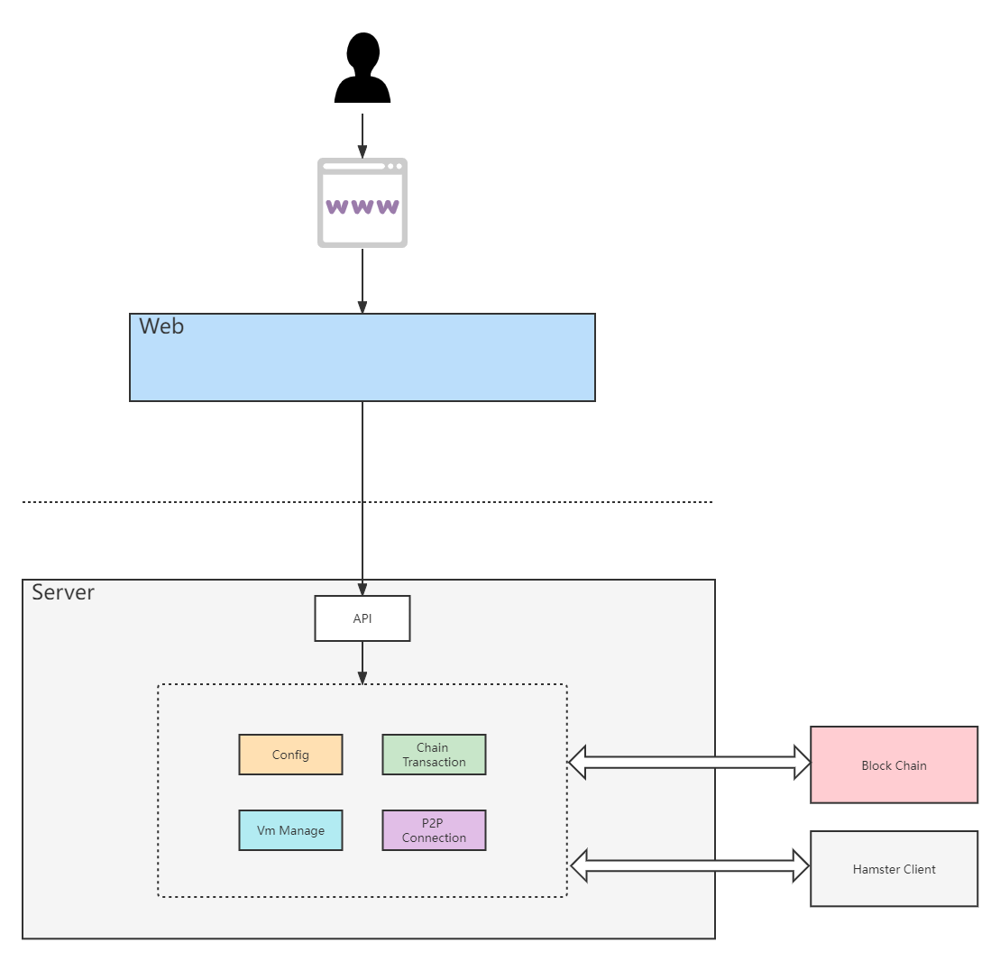

<div align=center>

</div>
<div align=center>


</div>


[github](https://github.com/hamster-shared/hamster-provider): https://github.com/hamster-shared/hamster-provider

hamster is a blockchain-based blockchain infrastructure service. Any computing device can easily access the Hamster network.

# Project Guidelines

## 1. Basic Introduction

### 1.1 Project Introduction

> Hamster-Provider is a blockchain compute node based on [go-libp2p](https://github.com/libp2p/go-libp2p.git) and [libvirt-go](https://github.com/libvirt/libvirt-go), which provide trusted infrastructure services. It can provide users' idle resources to the Hamster Market in the form of virtual machines.

### 1.2 Contributing Guide

Hi! Thank you for choosing Hamster.

Hamster is a blockchain that providers infrastructure service.

We are excited that you are interested in contributing to Hamster. Before submitting your contribution though, please make sure to take a moment and read through the following guidelines.

#### 1.2.1 Issue Guidelines

- Issues are exclusively for bug reports, feature requests and design-related topics. Other questions may be closed directly.

- Before submitting an issue, please check if similar problems have already been issued.

#### 1.2.2 Pull Request Guidelines

- Fork this repository to your own account. Do not create branches here.

- Commit info should be formatted as `[File Name]: Info about commit.` (e.g. `README.md: Fix xxx bug`)

- If your PR fixes a bug, please provide a description about the related bug.

- Merging a PR takes two maintainers: one approves the changes after reviewing, and then the other reviews and merges.

### 1.3 Version list

- main: 1.0.0 code, for prod
- develop: 2.0.0 dev code, for test

## 2. Getting started

```
- node version > v16.0.0
- golang version >= v1.17
- IDE recommendation: Goland
```

### 2.1 server project

```bash

# install package dependency

## ubuntu
sudo apt install qemu-kvm libvirt-daemon-system libvirt-clients bridge-utils virtinst virt-manager libvirt-devel
sudo systemctl is-active libvirtd

## centos
yum install -y qemu-kvm libvirt virt-install libvirt-dev
systemctl start libvirtd && systemctl enable libvirtd


# clone the project
git clone https://github.com/hamster-shared/hamster-provider.git

# open frontend directory
cd frontend

# install frontend dependency
npm install

# build frontend 
npm run serve

# go to root directory
cd ..

# use go mod And install the go dependency package
go mod tidy

# Compile 
go build

# Run init config
./hamster-provider init (windows The run command is hamster-provider.exe)

# Run Daemon 
./hamster-provider daemon (windows The run command is hamster-provider.exe)

```


## 3. Technical selection

- Frontend: using [Vue-Vben-Admin](https://github.com/vbenjs/vue-vben-admin) based on [Vue](https://vuejs.org)，to code the page.
- Backend: using [Gin](https://gin-gonic.com/) to quickly build basic RESTful API. [Gin](https://gin-gonic.com/)is a web framework written in Go (Golang).
- Config: using [cobra](https://github.com/spf13/cobra) and [viper](https://github.com/spf13/viper) to implement `json` config file。
- Virtualization: linux using [libvirt-go](https://github.com/libvirt/libvirt-go) to manage virtual machines , windows using [hyper-v](https://docs.microsoft.com/en-us/virtualization/hyper-v-on-windows/) 

## 4. Project Architecture

### 4.1 Architecture Diagram




### 4.3 Project Layout

```       
    ├─cmd                (command line)
    ├─core
    │  ├─context         (server context)
    │  ├─corehttp        (gin route) 
    │  └─modules      
    │      ├─chain       (chain transaction sdk)
    │      ├─config      (config)
    │      ├─event       (chain event impl) 
    │      ├─listener    (chain listener)
    │      ├─p2p         (p2p util)
    │      ├─pk          (keypair manager)
    │      ├─utils       (utils)
    │      └─vm          (Virtualization impl with docker、libvirt、hyper-v)
    ├─doc                (doc directory)
    ├─frontend        
    │  ├─build           
    │  ├─mock            (api mock) 
    │  ├─public          (deploy templates）
    │  ├─src
    │  │  ├─api          (frontend apis)
    │  │  ├─assets       (static files)
    │  │  ├─components   (components)
    │  │  ├─design
    │  │  ├─directives
    │  │  ├─enums
    │  │  ├─hooks
    │  │  ├─layouts      (layouts)
    │  │  ├─locales      (locale i18n)
    │  │  ├─logics       
    │  │  ├─router       (vue routers)
    │  │  ├─settings     
    │  │  ├─store        (vuex state management)  
    │  │  ├─utils        (frontend common utilitie)
    │  │  └─views        (pages)
    │  ├─tests
    │  └─types
    └─test               (provider integration test)
            

```

## 5. Features

- Configuration management: Provider parameters can be managed through configuration files and pages
- Blockchain communication: monitor blockchain events, accept orders on the chain, and establish a heartbeat
- Virtualized resource management: Create virtualized resources according to order requirements and complete corresponding order agreements
- p2p link management: coordinate the hamster client to establish peer-to-peer communication, so that the control side can access the created virtual machine

## 6. Knowledge base

### 6.1 Team blog

> https://github.com/hamster-shared
>


## 7. Contributors

Thank you for considering your contribution to hamster!

<a href="https://github.com/hamster-shared/hamster-provider/graphs/contributors">
  
</a>

## 8. Commercial considerations

If you use this project for commercial purposes, please comply with the Apache2.0 agreement and retain the author's technical support statement.
